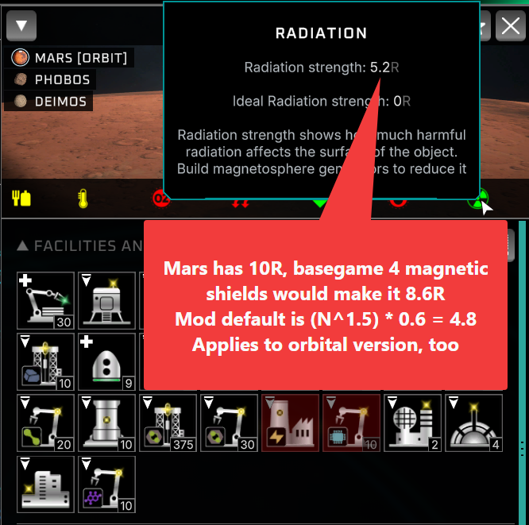
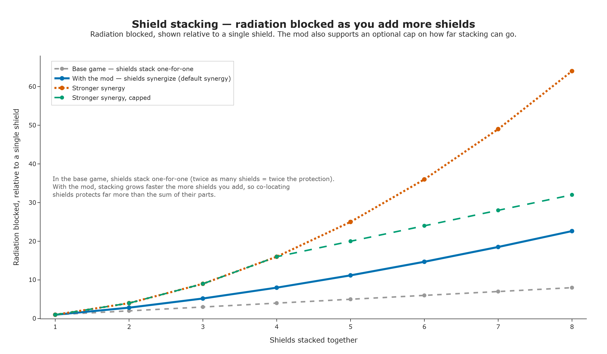

# Shield Synergy

Vanilla radiation shields stack one-for-one, so mitigating a massive source is basically infeasible: terraforming Io needs roughly 1425-1660 shields, around 480 MT of metal or alloy. Shield Synergy gives a modest boost against small radiation problems, but its main purpose is letting shields synergize so late-game terraforms of huge radiation sources become achievable, without exploits like starting a build on Earth then canceling it over and over.

## What it does

- Building multiple radiation shields at the same site now rewards you for stacking: the more you have, the bigger the bonus each additional one adds, instead of every shield contributing the same flat amount.
- A single shield behaves exactly like vanilla. The synergy bonus only kicks in once you're stacking two or more.
- Tunable curve: you decide how much extra reward stacking gives, from a small nudge to a steep payoff.
- Optional safety cap so a huge shield cluster can't become absurdly overpowered.
- One toggle to turn it off entirely and get byte-identical vanilla behavior.

## Before / after

Vanilla: 4 shields protect exactly 4x as much as 1 shield, no more, no less. With Shield Synergy (default settings), those same 4 shields protect noticeably more than 4x a single shield, because each additional shield compounds the effect instead of just adding to it.

Think of it like a power curve instead of a straight line: with a straight line, shield #10 helps exactly as much as shield #2. With a power curve, shield #10 helps _more_ than shield #2 did: stacking pays off increasingly, not just proportionally.

## Configuration

Edit `BepInEx/config/marr75.solarexpanse.shieldsynergy.cfg`, or use the in-game Configuration Manager if you have it installed. All settings apply live. No restart needed.

- **`ShieldSynergyEnabled`**: master on/off switch. Off = vanilla flat-sum shielding.
- **`ShieldSynergyExponent`** (default `1.5`): how steep the stacking payoff is. `1.0` is vanilla (no bonus). Higher numbers make each additional shield worth more. The game's own habitability math tapers off at high radiation reduction, so cranking this very high mostly buys diminishing returns past a point. A mild-to-moderate value is usually the sweet spot.
- **`ShieldSynergyMaxMultiplier`** (default `0.0`, meaning uncapped): an optional ceiling on how far the stacking bonus can multiply your shielding, in case a very large shield cluster combined with a high exponent gets out of hand for your game.

## Requirements

- Solar Expanse + BepInEx 5 (Mono/x64).

## Install

1. Install BepInEx 5.
2. Drop the `ShieldSynergy` folder into `BepInEx/plugins/`.

## Building (developers)

`dotnet build` deploys the DLL to the game's plugins folder via the post-build target. See `AGENTS.md`.
